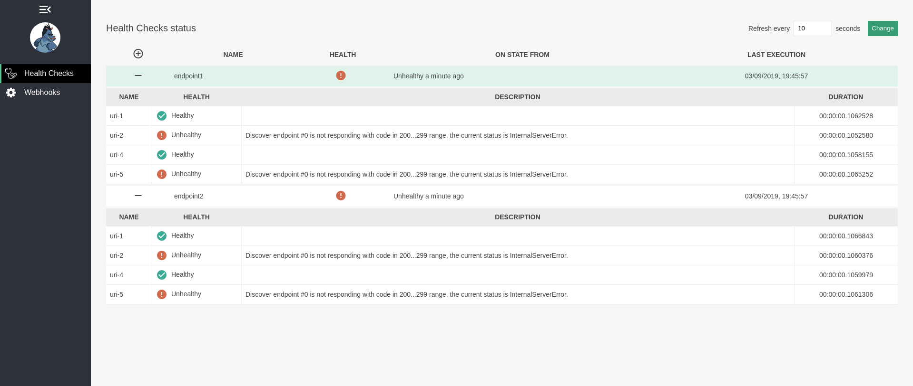
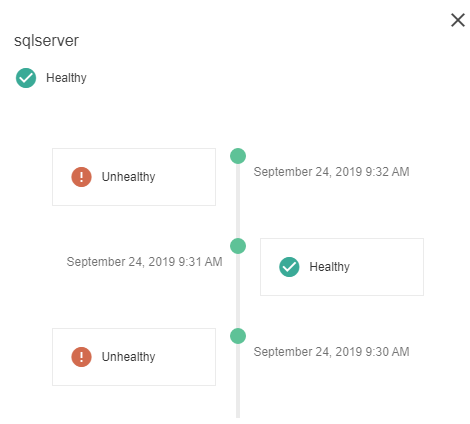
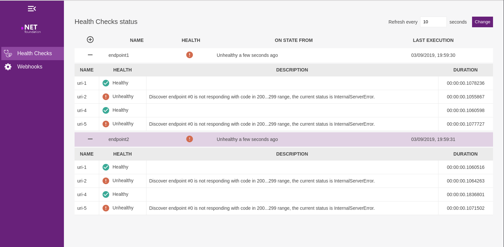

[](https://ci.appveyor.com/project/Xabaril/aspnetcore-diagnostics-healthchecks)

[](https://ci.appveyor.com/project/xabaril/aspnetcore-diagnostics-healthchecks/history)

# AspNetCore.Diagnostics.HealthChecks

This repository offers a wide collection of **ASP.NET Core** Health Check packages for widely used services and platforms.

**ASP.NET Core** versions supported: 2.2, 3.0 and 3.1

# Sections

## Previous versions documentation

- [NetCore 2.2](https://github.com/Xabaril/AspNetCore.Diagnostics.HealthChecks/blob/netcore-2.2/README.md)
- [NetCore 3.0](https://github.com/Xabaril/AspNetCore.Diagnostics.HealthChecks/blob/netcore-3.0/README.md)

## HealthChecks

- [Health Checks](#Health-Checks)
- [Health Checks Push Results](#HealthCheck-push-results)

## HealthChecks UI

- [UI](#HealthCheckUI)
- [UI Storage Providers](#UI-Storage-Providers)
- [UI Database Migrations](#UI-Database-Migrations)
- [History Timeline](#Health-status-history-timeline)
- [Configuration](#Configuration)
- [Webhooks and Failure Notifications](#Webhooks-and-Failure-Notifications)
- [HttpClient and HttpMessageHandler Configuration](#UI-Configure-HttpClient-and-HttpMessageHandler-for-Api-and-Webhooks-endpoints)

## HealthChecks UI and Kubernetes

- [Kubernetes Operator](#UI-Kubernetes-Operator)
- [Kubernetes automatic services discovery](#UI-Kubernetes-automatic-services-discovery)

## HealthChecks and Devops

- [Releases Gates for Azure DevOps Pipelines](#HealthChecks-as-Release-Gates-for-Azure-DevOps-Pipelines)

## HealthChecks Tutorials

- [Tutorials, Demos and walkthroughs](#tutorials-demos-and-walkthroughs-on-aspnet-core-healthchecks)

## Health Checks

HealthChecks packages include health checks for:

- Sql Server
- MySql
- Oracle
- Sqlite
- RavenDB
- Postgres
- EventStore
- RabbitMQ
- IbmMQ
- Elasticsearch
- Solr
- Redis
- System: Disk Storage, Private Memory, Virtual Memory, Process, Windows Service
- Azure Service Bus: EventHub, Queue and Topics
- Azure Storage: Blob, Queue and Table
- Azure Key Vault
- Azure DocumentDb
- Azure IoT Hub
- Amazon DynamoDb
- Amazon S3
- Network: Ftp, SFtp, Dns, Tcp port, Smtp, Imap
- MongoDB
- Kafka
- Identity Server
- Uri: single uri and uri groups
- Consul
- Hangfire
- SignalR
- Kubernetes

> We support netcoreapp 2.2, 3.0 and 3.1. Please use package versions 2.2.X, 3.0.X and 3.1.X to target different versions.

```PowerShell
Install-Package AspNetCore.HealthChecks.System
Install-Package AspNetCore.HealthChecks.Network
Install-Package AspNetCore.HealthChecks.SqlServer
Install-Package AspNetCore.HealthChecks.MongoDb
Install-Package AspNetCore.HealthChecks.Npgsql
Install-Package AspNetCore.HealthChecks.Elasticsearch
Install-Package AspNetCore.HealthChecks.Solr
Install-Package AspNetCore.HealthChecks.Redis
Install-Package AspNetCore.HealthChecks.EventStore
Install-Package AspNetCore.HealthChecks.AzureStorage
Install-Package AspNetCore.HealthChecks.AzureServiceBus
Install-Package AspNetCore.HealthChecks.AzureKeyVault
Install-Package AspNetCore.HealthChecks.Azure.IoTHub
Install-Package AspNetCore.HealthChecks.MySql
Install-Package AspNetCore.HealthChecks.DocumentDb
Install-Package AspNetCore.HealthChecks.SqLite
Install-Package AspNetCore.HealthChecks.RavenDB
Install-Package AspNetCore.HealthChecks.Kafka
Install-Package AspNetCore.HealthChecks.RabbitMQ
Install-Package AspNetCore.HealthChecks.IbmMQ
Install-Package AspNetCore.HealthChecks.OpenIdConnectServer
Install-Package AspNetCore.HealthChecks.DynamoDB
Install-Package AspNetCore.HealthChecks.Oracle
Install-Package AspNetCore.HealthChecks.Uris
Install-Package AspNetCore.HealthChecks.Aws.S3
Install-Package AspNetCore.HealthChecks.Consul
Install-Package AspNetCore.HealthChecks.Hangfire
Install-Package AspNetCore.HealthChecks.SignalR
Install-Package AspNetCore.HealthChecks.Kubernetes
Install-Package AspNetCore.HealthChecks.Gcp.CloudFirestore
```

Once the package is installed you can add the HealthCheck using the **AddXXX** IServiceCollection extension methods.

> We use [MyGet](https://www.myget.org/F/xabaril/api/v3/index.json) feed for preview versions of HealthChecks packages.

```csharp
public void ConfigureServices(IServiceCollection services)
{
    services.AddHealthChecks()
        .AddSqlServer(Configuration["Data:ConnectionStrings:Sql"])
        .AddRedis(Configuration["Data:ConnectionStrings:Redis"]);
}
```

Each HealthCheck registration supports also name, tags, failure status and other optional parameters.

```csharp
public void ConfigureServices(IServiceCollection services)
{
      services.AddHealthChecks()
          .AddSqlServer(
              connectionString: Configuration["Data:ConnectionStrings:Sql"],
              healthQuery: "SELECT 1;",
              name: "sql",
              failureStatus: HealthStatus.Degraded,
              tags: new string[] { "db", "sql", "sqlserver" });
}
```

## HealthCheck push results

HealthChecks include a _push model_ to send HealthCheckReport results into configured consumers. The project **AspNetCore.HealthChecks.Publisher.ApplicationInsights**, **AspNetCore.HealthChecks.Publisher.Datadog**, **AspNetCore.HealthChecks.Publisher.Prometheus** or **AspNetCore.HealthChecks.Publisher.Seq** define a consumers to send report results to Application Insights, Datadog, Prometheus or Seq.

Include the package in your project:

```powershell
install-package AspNetcore.HealthChecks.Publisher.ApplicationInsights
install-package AspNetcore.HealthChecks.Publisher.Datadog
install-package AspNetcore.HealthChecks.Publisher.Prometheus
install-package AspNetcore.HealthChecks.Publisher.Seq
```

Add publisher[s] into the _IHealthCheckBuilder_

```csharp
services.AddHealthChecks()
        .AddSqlServer(connectionString: Configuration["Data:ConnectionStrings:Sample"])
        .AddCheck<RandomHealthCheck>("random")
        .AddApplicationInsightsPublisher()
        .AddDatadogPublisher("myservice.healthchecks")
        .AddPrometheusGatewayPublisher();
```

## HealthCheckUI



[UI Changelog](./doc/ui-changelog.md)

The project HealthChecks.UI is a minimal UI interface that stores and shows the health checks results from the configured HealthChecks uris.

To integrate HealthChecks.UI in your project you just need to add the HealthChecks.UI services and middlewares available in the package: **AspNetCore.HealthChecks.UI**

```csharp

using HealthChecks.UI.Core;
using HealthChecks.UI.InMemory.Storage;

public class Startup
{
    public void ConfigureServices(IServiceCollection services)
    {
        services
        .AddHealthChecksUI()
        .AddInMemoryStorage()
    }

    public void Configure(IApplicationBuilder app, IHostingEnvironment env)
    {
        app
          .UseRouting()
          .UseEndpoints(config =>
           {
             config.MapHealthChecksUI();
          });
    }
}
```

This automatically registers a new interface on **/healthchecks-ui** where the spa will be served.

> Optionally, _MapHealthChecksUI_ can be configured to serve its health api, webhooks api and the front-end resources in different endpoints using the MapHealthChecksUI(setup =>) method overload. Default configured urls for this endpoints can be found [here](https://github.com/Xabaril/AspNetCore.Diagnostics.HealthChecks/blob/master/src/HealthChecks.UI/Configuration/Options.cs)

**Important note:** It is important to understand that the API endpoint that the UI serves is used by the frontend spa to receive the result of all processed checks. The health reports are collected by a background hosted service and the API endpoint served at /healthchecks-api by default is the url that the spa queries.

Do not confuse this UI api endpoint with the endpoints we have to configure to declare the target apis to be checked on the UI project in the [appsettings HealthChecks configuration section](https://github.com/Xabaril/AspNetCore.Diagnostics.HealthChecks/blob/master/samples/HealthChecks.UI.Sample/appsettings.json)

When we target applications to be tested and shown on the UI interface, those endpoints have to register the UIResponseWriter that is present on the **AspNetCore.HealthChecks.UI.Client** as their [ResponseWriter in the HealthChecksOptions](https://github.com/Xabaril/AspNetCore.Diagnostics.HealthChecks/blob/master/samples/HealthChecks.Sample/Startup.cs#L48) when configuring MapHealthChecks method.

### UI Storage Providers

HealthChecks UI offers several storage providers, available as different nuget packages.

The current supported databases are:

- [AspNetCore.HealthChecks.UI.InMemory.Storage](https://www.nuget.org/packages/AspNetCore.HealthChecks.UI.InMemory.Storage)
- [AspNetCore.HealthChecks.UI.SqlServer.Storage](https://www.nuget.org/packages/AspNetCore.HealthChecks.UI.SqlServer.Storage)
- [AspNetCore.HealthChecks.UI.SQLite.Storage](https://www.nuget.org/packages/AspNetCore.HealthChecks.UI.SQLite.Storage)
- [AspNetCore.HealthChecks.UI.PostgreSQL.Storage](https://www.nuget.org/packages/AspNetCore.HealthChecks.UI.PostgreSQL.Storage)
- [AspNetCore.HealthChecks.UI.MySql.Storage](https://www.nuget.org/packages/AspNetCore.HealthChecks.UI.MySql.Storage)

All the storage providers are extensions of HealthChecksUIBuilder:

**InMemory**

```csharp
  services
    .AddHealthChecksUI()
    .AddInMemoryStorage()
```

**Sql Server**

```csharp
  services
    .AddHealthChecksUI()
    .AddSqlServer("connectionString");
```

**Postgre SQL**

```csharp

  services
    .AddHealthChecksUI()
    .AddPostgreSqlStorage("connectionString");

```

**MySql**

```csharp

  services
    .AddHealthChecksUI()
    .AddMySqlStorage("connectionString");

```

**Sqlite**

```csharp
  services
    .AddHealthChecksUI()
    .AddSqliteStorage($"Data Source=sqlite.db");

```

### UI Database Migrations

**Database Migrations** are enabled by default, if you need to disable migrations you can use the AddHealthChecksUI setup:

```csharp
  services
    .AddHealthChecksUI(setup => setup.DisableDatabaseMigrations())
    .AddInMemoryStorage();
```

Or you can use IConfiguration providers, like json file or environment variables:

```json
 "HealthChecksUI": {
   "DisableMigrations": true
 }

```

### Health status history timeline

By clicking details button in the healthcheck row you can preview the health status history timeline:



**Note**: HealthChecks UI saves an execution history entry in the database whenever a HealthCheck status changes from Healthy to Unhealthy and viceversa.

This information is displayed in the status history timeline but we do not perform purge or cleanup tasks in users databases. In order to limit the maximum history entries that are sent by the UI Api middleware to the frontend you can do a database cleanup or set the maximum history entries served by endpoint using:

```csharp
  services.AddHealthChecksUI(setup =>
  {
     // Set the maximum history entries by endpoint that will be served by the UI api middleware
      setup.MaximumHistoryEntriesPerEndpoint(50);
  });
```

**HealthChecksUI** is also available as a _docker image_ You can read more about [HealthChecks UI Docker image](./doc/ui-docker.md).

### Configuration

By default HealthChecks returns a simple Status Code (200 or 503) without the HealthReport data. If you want that HealthCheck-UI shows the HealthReport data from your HealthCheck you can enable it adding an specific ResponseWriter.

```csharp
 app
    .UseRouting()
    .UseEndpoints(config =>
    {
      config.MapHealthChecks("/healthz", new HealthCheckOptions
      {
        Predicate = _ => true,
        ResponseWriter = UIResponseWriter.WriteHealthCheckUIResponse
      });
```

> _WriteHealthCheckUIResponse_ is defined on HealthChecks.UI.Client nuget package.

To show these HealthChecks in HealthCheck-UI they have to be configured through the **HealthCheck-UI** settings.

You can configure these Healthchecks and webhooks by using _IConfiguration_ providers (appsettings, user secrets, env variables) or the _AddHealthChecksUI(setupSettings: setup =>)_ method can be used too.

#### Sample 2: Configuration using appsettings.json

```json
{
  "HealthChecksUI": {
    "HealthChecks": [
      {
        "Name": "HTTP-Api-Basic",
        "Uri": "http://localhost:6457/healthz"
      }
    ],
    "Webhooks": [
      {
        "Name": "",
        "Uri": "",
        "Payload": "",
        "RestoredPayload": ""
      }
    ],
    "EvaluationTimeInSeconds": 10,
    "MinimumSecondsBetweenFailureNotifications": 60
  }
}
```

#### Sample 2: Configuration using setupSettings method:

```csharp
  services
    .AddHealthChecksUI(setupSettings: setup =>
    {
       setup.AddHealthCheckEndpoint("endpoint1", "http://localhost:8001/healthz");
       setup.AddHealthCheckEndpoint("endpoint2", "http://remoteendpoint:9000/healthz");
       setup.AddWebhookNotification("webhook1", uri: "http://httpbin.org/status/200?code=ax3rt56s", payload: "{...}");
    })
    .AddSqlServer("connectionString");
```

**Note**: The previous configuration section was HealthChecks-UI, but due to incompatibilies with Azure Web App environment variables the section has been moved to HealthChecksUI. The UI is retro compatible and it will check the new section first, and fallback to the old section if the new section has not been declared.

    1.- HealthChecks: The collection of health checks uris to evaluate.
    2.- EvaluationTimeInSeconds: Number of elapsed seconds between health checks.
    3.- Webhooks: If any health check returns a *Failure* result, this collections will be used to notify the error status. (Payload is the json payload and must be escaped. For more information see the notifications documentation section)
    4.- MinimumSecondsBetweenFailureNotifications: The minimum seconds between failure notifications to avoid receiver flooding.

```json
{
  "HealthChecksUI": {
    "HealthChecks": [
      {
        "Name": "HTTP-Api-Basic",
        "Uri": "http://localhost:6457/healthz"
      }
    ],
    "Webhooks": [
      {
        "Name": "",
        "Uri": "",
        "Payload": "",
        "RestoredPayload": ""
      }
    ],
    "EvaluationTimeInSeconds": 10,
    "MinimumSecondsBetweenFailureNotifications": 60
  }
}
```

### Using relative urls in Health Checks and Webhooks configurations (UI 3.0.5 onwards)

If you are configuring the UI in the same process where the HealthChecks and Webhooks are listening, from version 3.0.5 onwards the UI can use relative urls
and it will automatically discover the listening endpoints by using server IServerAddressesFeature

Sample:

```csharp

  //Configuration sample with relative url health checks and webhooks

  services
    .AddHealthChecksUI(setupSettings: setup =>
    {
       setup.AddHealthCheckEndpoint("endpoint1", "/health-databases");
       setup.AddHealthCheckEndpoint("endpoint2", "health-messagebrokers");
       setup.AddWebhookNotification("webhook1", uri: "/notify", payload: "{...}");
    })
    .AddSqlServer("connectionString");
```

You can also use relative urls when using IConfiguration providers like appsettings.json

### Webhooks and Failure Notifications

If the **WebHooks** section is configured, HealthCheck-UI automatically posts a new notification into the webhook collection. HealthCheckUI uses a simple replace method for values in the webhook's **Payload** and **RestorePayload** properties. At this moment we support two bookmarks:

[[LIVENESS]] The name of the liveness that returns _Down_.

[[FAILURE]] A detail message with the failure.

[[DESCRIPTIONS]] Failure descriptions

Webhooks can be configured with configuration providers and also by code. Using code allows greater customization as you can setup you own user functions to customize output messages or configuring if a payload should be sent to a given webhook endpoint.

The [web hooks section](./doc/webhooks.md) contains more information and webhooks samples for Microsoft Teams, Azure Functions, Slack and more.

## UI Style and branding customization

### Sample of dotnet styled UI



Since version 2.2.34, UI supports custom styles and branding by using a **custom style sheet** and **css variables**.
To add your custom styles sheet, use the UI setup method:

```csharp
  app
   .UseRouting()
   .UseEndpoints(config =>
    {
      config.MapHealthChecksUI(setup =>
      {
        setup.AddCustomStylesheet("dotnet.css");
      });
   });

```

You can visit the section [custom styles and branding](./doc/styles-branding.md) to find source samples and get further information about custom css properties.

## UI Configure HttpClient and HttpMessageHandler for Api and Webhooks endpoints

If you need to configure a proxy, or set an authentication header, the UI allows you to configure the HttpMessageHandler and the HttpClient for the webhooks and healtheck api endpoints.

```csharp

services.AddHealthChecksUI(setupSettings: setup =>
{
    setup.ConfigureApiEndpointHttpclient((sp, client) =>
    {
        client.DefaultRequestHeaders.Authorization = new AuthenticationHeaderValue("Bearer", "supertoken");
    })
    .UseApiEndpointHttpMessageHandler(sp =>
        {
            return new HttpClientHandler
            {
                Proxy = new WebProxy("http://proxy:8080")
            };
        })
    .ConfigureWebhooksEndpointHttpclient((sp, client) =>
    {
        client.DefaultRequestHeaders.Authorization = new AuthenticationHeaderValue("Bearer", "sampletoken");
    })
    .UseWebhookEndpointHttpMessageHandler(sp =>
    {
        return new HttpClientHandler()
        {
            Properties =
            {
                ["prop"] = "value"
            }
        };
    });
})
.AddInMemoryStorage();

```

## UI Kubernetes Operator

If you are running your workloads in kubernetes, you can benefit from it and have your healthchecks environment ready and monitoring in seconds.

You can get for information in our [HealthChecks Operator docs](./doc/k8s-operator.md)

## UI Kubernetes automatic services discovery

<!--  -->

HealthChecks UI supports automatic discovery of k8s services exposing pods that have health checks endpoints. This means, you can benefit from it and avoid registering all the endpoints you want to check and let the UI discover them using the k8s api.

You can get more information [here](./doc/k8s-ui-discovery.md)

## HealthChecks as Release Gates for Azure DevOps Pipelines

HealthChecks can be used as [Release Gates for Azure DevOps](https://docs.microsoft.com/en-us/azure/devops/pipelines/release/approvals/gates?view=azure-devops) using this [Visual Studio Market place Extension](https://marketplace.visualstudio.com/items?itemName=luisfraile.vss-services-aspnetcorehealthcheck-extensions).

Check this [README](./extensions/README.md) on how to configure it.

## Tutorials, demos and walkthroughs on ASP.NET Core HealthChecks

- [ASP.NET Core HealthChecks and Kubernetes Liveness / Readiness by Carlos Landeras](./doc/kubernetes-liveness.md)
- [ASP.NET Core HealthChecks, BeatPulse UI, Webhooks and Kubernetes Liveness / Readiness probes demos at SDN.nl live WebCast by Carlos Landeras](https://www.youtube.com/watch?v=kzRKGCmGbqo)
- [ASP.NET Core HealthChecks features video by @condrong](https://t.co/YriQ6cLWVm)
- [How to set up ASP.NET Core 2.2 Health Checks with BeatPulse's AspNetCore.Diagnostics.HealthChecks by Scott Hanselman](https://www.hanselman.com/blog/HowToSetUpASPNETCore22HealthChecksWithBeatPulsesAspNetCoreDiagnosticsHealthChecks.aspx)
- [ASP.NET Core HealthChecks announcement](https://t.co/47M9FBfpWF)
- [ASP.NET Core 2.2 HealthChecks Explained by Thomas Ardal](https://blog.elmah.io/asp-net-core-2-2-health-checks-explained/)
- [Health Monitoring on ASP.NET Core 2.2 / eShopOnContainers](https://docs.microsoft.com/en-us/dotnet/standard/microservices-architecture/implement-resilient-applications/monitor-app-health)

## Contributing

AspNetCore.Diagnostics.HealthChecks wouldn't be possible without the time and effort of its contributors. The team is made up of Unai Zorrilla Castro [@unaizorrilla](https://github.com/unaizorrilla), Luis Ruiz Pavón [@lurumad](https://github.com/lurumad), Carlos Landeras [@carloslanderas](https://github.com/carloslanderas), Eduard Tomás [@eiximenis](https://github.com/eiximenis) and Eva Crespo [@evacrespob](https://github.com/evacrespob)

_Our valued committers are_: Hugo Biarge @hbiarge, Matt Channer @mattchanner, Luis Fraile @lfraile, Bradley Grainger @bgrainger, Simon Birrer @SbiCA, Mahamadou Camara @poumup, Jonathan Berube @joncloud, Daniel Edwards @dantheman999301, Mike McFarland @roketworks, Matteo @Franklin89, Miňo Martiniak @Burgyn, Peter Winkler @pajzo, @mikevanoo,Alexandru Rus @AlexandruRus23,Volker Thiel @riker09, Ahmad Magdy @Ahmad-Magdy, Marcel Lambacher @Marcel-Lambacher, Ivan Maximov @sungam3r, David Bottiau @odonno,ZeWizard @zeWizard, Ruslan Popovych @rpopovych, @jnovick, Marcos Palacios @mpcmarcos, Gerard Godone-Maresca @ggmaresca, Facundo @fglaeser, Daniel Nordström @SpaceOgre, @mphelt

If you want to contribute to the project and make it better, your help is very welcome. You can contribute with helpful bug reports, features requests and also submitting new features with pull requests.

1. Read and follow the [Don't push your pull requests](https://www.igvita.com/2011/12/19/dont-push-your-pull-requests/)
2. Build.ps1 is working on local and AppVeyor.
3. Follow the code guidelines and conventions.
4. New features are not only code, tests and documentation are also mandatory.
