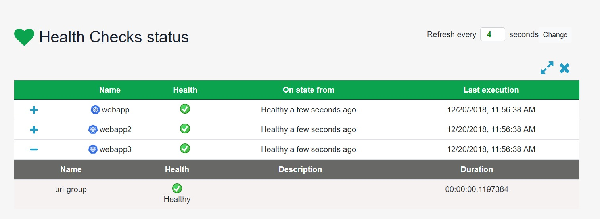

## Health Checks UI automatic Kubernetes services discovery

HealthChecks UI supports automatic discovery of k8s services exposing pods that have health checks endpoints. This means, you can benefit from it and avoid registering all the endpoints you want to check and let the UI discover them using the k8s api.



The default mechanism to register the target endpoints to be queried for health is using the UI project appsettings.json and declare our named endpoints:

>Example:

```json
{
  "HealthChecksUI": {
    "HealthChecks": [
      {
        "Name": "Http and UI on single project",
        "Uri": "http://localhost:6001/healthz"
      }
    ],
    "Webhooks": [],
    "EvaluationTimeInSeconds": 10,
    "MinimumSecondsBetweenFailureNotifications": 60
  }
}
```


To enable Kubernetes discovery you just need to configure some settings inside the UI project appsettings.json:

```json
{
  "HealthChecksUI": {
    "KubernetesDiscoveryService": {
      "Enabled": true,
      "HealthPath": "healthz",
      "ServicesLabel": "HealthChecks",
      "ServicesPathAnnotation": "HealthChecksPath",
      "ServicesPortAnnotation": "HealthChecksPort",
      "ServicesSchemeAnnotation": "HealthChecksScheme"
    }
  }
}
```

By default, it'll use the in-cluster pod config if running inside of a pod and the kubectl config file located at `~/.kube.config` otherwise. This can be overriden by setting a custom cluster host and token, like this:

```json
{
  "HealthChecksUI": {
    "KubernetesDiscoveryService": {
      "Enabled": true,
      "ClusterHost": "https://myaks-962d02ba.hcp.westeurope.azmk8s.io:443",
      "Token": "eyJhbGciOiJSUzI1NiIsImtpZCI6IiJ9.eyJpc3M...",
      "HealthPath": "healthz",
      "ServicesLabel": "HealthChecks",
      "ServicesPathAnnotation": "HealthChecksPath",
      "ServicesPortAnnotation": "HealthChecksPort",
      "ServicesSchemeAnnotation": "HealthChecksScheme"
    }
  }
}
```

### Parameters description

Here are all the available parameters detailed:

| Parameter                | Description                                                                                                                                                    | Default Value      |
| ------------------------ | -------------------------------------------------------------------------------------------------------------------------------------------------------------- | ------------------ |
| Enabled                  | Establishes if the k8s discovery service is enabled of disabled                                                                                                | false              |
| ClusterHost              | The uri of the kubernetes cluster                                                                                                                              |                    |
| Token                    | The token that will be sent to the cluster for authentication                                                                                                  |                    |
| HealthPath               | The default url path where the UI will call once the service is discovered                                                                                     | hc                 |
| ServicesLabel            | The labeled services the UI will look for in k8s                                                                                                               | HealthChecks       |
| ServicesPathAnnotation   | The annotation on a service that can override the configured url path                                                                                          | HealthChecksPath   |
| ServicesPortAnnotation   | The annotation on a service to define which port to call. If the annotation does not exist on the service the first defined port will be used                  | HealthChecksPort   |
| ServicesSchemeAnnotation | The annotation on a service to define which URI scheme to use for healthchecks. If the annotation does not exist on the service http will be used              | HealthChecksScheme |
| RefreshTimeOnSeconds     | Healthchecks refresh time in seconds                                                                                                                           | 300                |
| Namespaces               | The namespace(s) to query services in                                                                                                                          | []                 |
| UseDNSNames              | Use Kubernetes DNS names instead of cluster IPs to call services (ex: `http(s)://service.namespace/hc`) . Recommended to only set true when running in-cluster | false              |

## Labeling Services for discovery in Kubernetes

The `ServicesLabel` option provided in the discovery settings (by default HealthChecks) is the label that will be used to filter k8s services.

If you want to tag a service just execute the k8s command line tool (kubectl) using the following command:

`kubectl label service service-name HealthChecks=true`

Change `HealthChecks=true` by your configured ServiceLabel if you gave another value for it.

The `ServicesPathAnnotation` option (by default HealthChecksPath) provides a method for services to override the default health path configured.

The `ServicesPortAnnotation` option (by default HealthChecksPort) provides a method for services to specify which port to use for health checks. By default the first port defined on the service will be used. The annotation can refer to either the name of the port or the port number.

The `ServicesSchemeAnnotation` option (by default HealthChecksScheme) provides a method for services to specify which URI scheme to use for health checks. By default the HTTP will be used as the URI scheme.

## How it works

The kubernetes service discovery will retrieve from the k8s api all the labelled services and from the metadata it will try to build the target url to query for health.

If you have exposed a deployment using for example a LoadBalancer on port 50000 and your configured HealthPath is "healthz" the target url to be queried would be : (ip/host):50000/healthz

If Namespaces is set only the labelled services within the specified namespace(s) will be queried. By default it will query all services in the cluster.

**NOTE**: Remember if you are using `kubectl proxy` you can configure your cluster address as http://localhost:8001.

## Kubernetes Role-Based Access

The service account being used for the Kubernetes Service Discovery needs the following role on its service account for the service discovery to work:

``` yaml
apiVersion: rbac.authorization.k8s.io/v1
kind: Role
metadata:
  name: healthchecksui
rules:
- apiGroups: [""]
  resources: ["services"]
  verbs: ["list"]
```

The role needs to be added in every namespace configured, and a corresponding `RoleBinding` to bind it to the service account. If you wish to query all namespaces, replace `Role` with `ClusterRole` and `RoleBinding` to `ClusterRoleBinding`.