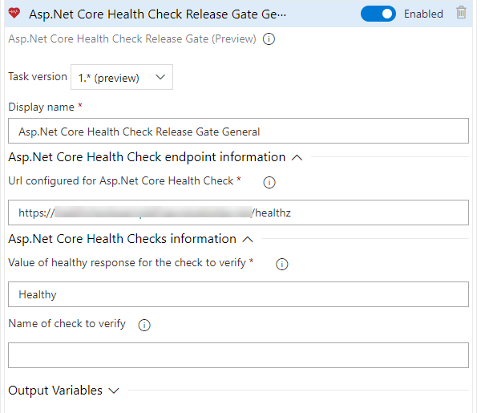
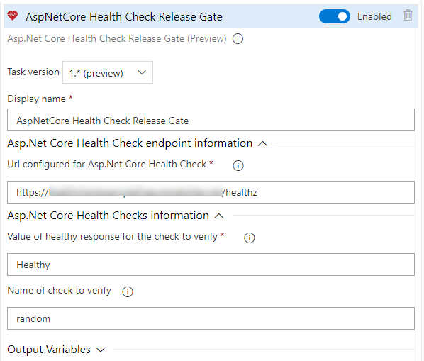

# Azure DevOps ASP.NET Core health checks extensions

## Azure DevOps Release Gate for ASP.NET Core Health checks

This Release Gate allows you to add a new Gate based on [**Asp.Net Core Health Checks**](https://docs.microsoft.com/en-us/aspnet/core/host-and-deploy/health-checks?view=aspnetcore-2.2).

More info on [**Release Gates for Azure DevOps**](https://docs.microsoft.com/en-us/azure/devops/pipelines/release/approvals/gates?view=azure-devops)

### Prerequisites
To use this extension first you must configure **Asp.Net Core Health Checks** in your desired application, to install it follow this [walk-through](https://docs.microsoft.com/en-us/aspnet/core/host-and-deploy/health-checks?view=aspnetcore-2.2)

You also need the [**Health Check UI**](https://github.com/Xabaril/AspNetCore.Diagnostics.HealthChecks) as the Release Gate needs to call the endpoint returning the json information on Health Checks.

Once installed and deployed, you can start use this extenstion to use Health Checks as Release Gates

### Configuration

#### Basic Health Check 

When using int the basic mode, the Release Gate just checks the HTTP 200 OK result from the global Health Check. 
 

 To configure the extension in its basic form,you need to provide following parameters:
 - *Display name*: Name for the Release Gate.
 - *Url for Asp.Net Core Health Check*: Full url for your Asp.Net Core Health Check (i.e.: https://mywebsite.com/health).
 - *Value of healthy response for the check to verify*: By default, when using [**Health Check UI**](https://github.com/Xabaril/AspNetCore.Diagnostics.HealthChecks) it is *Healthy*, but it can be changed in the [**Health Checks Response Writer**](https://docs.microsoft.com/en-us/aspnet/core/host-and-deploy/health-checks?view=aspnetcore-2.2#customize-output) so review it when configuring it.

#### Filter by particular Health Check
With this, we can filter out for a particular Health Check from the configured ones, but this requires a little bit more configuration both in the tasks and in your application code.

When configuring it, we also need to modify the HTTP responses for it, as the Release Gates always checks for the HTTP 200 OK code, and if some Health Checks fails, by default it returns an HTTP 503 Error, which will make the Release Gate fail no matter if the particular Health Check is Healthy or not. So we need to add this code when configuring Health Check UI:
``` C#
app.UseHealthChecks("/healthz", new HealthCheckOptions()
{
    Predicate = _ => true,
    ResponseWriter = UIResponseWriter.WriteHealthCheckUIResponse,
    ResultStatusCodes =
            {
                [HealthStatus.Healthy] = StatusCodes.Status200OK,
                [HealthStatus.Degraded] = StatusCodes.Status200OK,
                [HealthStatus.Unhealthy] = StatusCodes.Status200OK
            }
});
```

 > **IMPORTANT**: If you plan to use this along with basic general check for different purposes you will need another endpoint with the default configuration on *ResultStatusCodes* so it returns HTTP 503 Error when one of them fails.

The tasks configuration will be like this:
 
 - *Display name*: Name for the Release Gate.
 - *Url for Asp.Net Core Health Check*: Full url for your Asp.Net Core Health Check (i.e.: https://mywebsite.com/health).
 - *Name of check to verify*: Name of the check configured in **Health Checks** to verify. (i.e.: sqlserver).
 - *Value of healthy response for the check to verify*: By default, when using [**Health Check UI**](https://github.com/Xabaril/AspNetCore.Diagnostics.HealthChecks) it is *Healthy*, but it can be changed in the [**Health Checks Response Writer**](https://docs.microsoft.com/en-us/aspnet/core/host-and-deploy/health-checks?view=aspnetcore-2.2#customize-output) so review it when configuring it.

